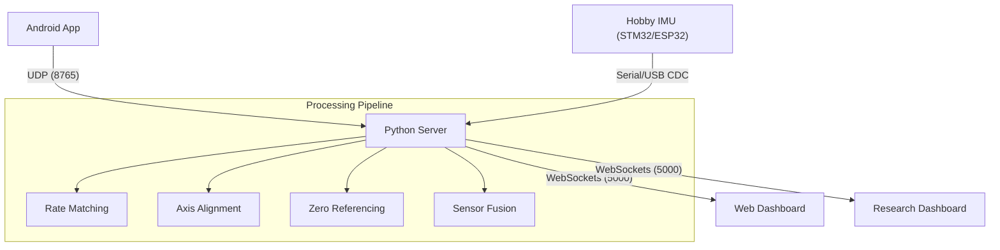

# IMU Research & Comparison Suite

A high-precision Inertial Measurement Unit (IMU) characterization and benchmarking toolkit. This suite enables real-time comparison between hobbyist IMU hardware (such as STM32, ESP32, BNO/MPU series) and factory-calibrated smartphone sensors. It features advanced sensor fusion algorithms, automated axis alignment, and industry-standard noise analysis tools.

---

## Overview

The system consists of three integrated components designed for embedded systems research and robotics development:

| Component | Functionality |
|-----------|-------------|
| **Android Application** | Captures high-fidelity sensor data from the phone's internal IMU and streams it over Wi-Fi via UDP using a premium glassmorphism interface. |
| **Python Server** | Orchestrates data ingestion from UDP (Phone) and Serial/USB CDC (Hobby IMU), managing synchronization, calibration, and filtering. |
| **Web Dashboard** | Provides real-time 3D visualization, comparative analytics, and a dedicated Research Suite for statistical noise characterization. |

---

## Architecture



---

## Detailed Features

### 1. AHRS Sensor Fusion Library
The Python server incorporates a comprehensive suite of Attitude and Heading Reference System (AHRS) algorithms to process raw accelerometer, gyroscope, and magnetometer data into stable quaternions and Euler angles. Available filters include:
- **Complementary Filter:** A classic alpha-blend filter operating in Euler space.
- **Complementary Quat Filter:** Uses Spherical Linear Interpolation (SLERP) to prevent gimbal lock while maintaining the simplicity of alpha-blending.
- **Madgwick Filter:** A gradient descent algorithm that uses accelerometer and magnetometer reference vectors to correct gyro-integrated quaternions.
- **Mahony Filter:** A Proportional-Integral (PI) controller that corrects the gyro via cross-product error before quaternion integration.
- **Extended Kalman Filter (EKF):** Uses process noise (gyro trust) and measurement noise (accel/mag trust) matrices to optimally estimate the state vector.

### 2. Research Analysis Suite
A dedicated tool (`/analysis`) for statistical noise characterization using stationary IMU recordings:
- **Overlapping Allan Deviation (OADEV):** The industry-standard method for identifying noise types across different time scales (Tau). It extracts Angle Random Walk (ARW), Bias Instability (BI), and Rate Random Walk (RRW). The overlapping variant reuses adjacent clusters to provide statistically reliable estimates even on short recordings.
- **RMS Noise & Standard Deviation:** Calculates total signal energy and noise amplitude around the mean for each axis.
- **Bias Drift Monitoring:** Plots a rolling mean of the Z-axis gyroscope over time to detect systematic drift caused by temperature changes, interference, or firmware quantization.

### 3. Automated Axis Alignment
Different IMU chips define their body-frame axes differently, leading to swapped axes or inverted signs. The suite includes an automated correlation-based alignment algorithm:
- When activated, the user moves both sensors together in all three degrees of freedom for 10 seconds.
- The server runs a brute-force search across all 48 possible axis mappings (6 permutations x 8 sign combinations).
- Using Pearson Correlation, it finds the mapping that highest correlates the hobby IMU's raw data with the reference phone's motion, permanently correcting the orientation without firmware changes.

### 4. Zero-Reference System
IMUs have independent absolute orientations when powered on. The Zero-Reference system establishes a relative baseline for fair comparison:
- Computes angle-wrapped differences (handling the +/- 180 degree boundary) between the absolute starting orientations of both devices.
- Ensures both IMUs read zero when placed in the same physical orientation, making angular drift immediately apparent.

### 5. Dynamic Rate Matching
The Android app and the Hobby IMU typically operate at different sampling frequencies (e.g., 200Hz vs 50Hz). 
- The server's broadcaster utilizes a target rate decimation strategy.
- It wakes up at precise intervals to emit the latest available data point from each source, ensuring perfectly aligned frame delivery to the browser for jitter-free visual comparison.

### 6. Android Application Pipeline
Built with Jetpack Compose, the mobile client acts as the reference data source:
- **Persistent UDP Streaming:** Operates via a foreground service, ensuring uninterrupted high-rate transmission even when the screen is locked.
- **Sensor Utilization:** Pulls raw data directly from the Android `SensorManager` and converts Android's factory-fused Rotation Vector (Quaternion) into aerospace-convention (ZYX) Euler angles.
- **UI & Data Export:** Features dynamic liquid-fill gauges for Yaw, Pitch, and Roll, a 3D Canvas wireframe, and local CSV/JSON export functionality.

---

## Step-by-Step Setup

### 1. Android App
1. Open the `/app` directory in Android Studio.
2. Connect your Android device and ensure USB Debugging is enabled.
3. Build and run the application.
4. In the "Stream" tab, enter your PC's local IP address and port `8765`.
5. Tap "Start Streaming".

### 2. Python Server
1. Ensure you have Python 3.8+ installed. Navigate to the server directory:
   ```bash
   cd pc_receiver
   pip install -r requirements.txt
   ```
2. Launch the server:
   ```bash
   # For Phone-only streaming
   python server.py
   
   # For Phone + Hobby IMU (replace COM4 with your actual port)
   python server.py --serial COM4 --baud 115200
   ```

### 3. Web Dashboard
1. Open your web browser and navigate to `http://localhost:5000`.
2. Use the Command Island at the top to toggle between Phone, IMU, and Comparison modes.
3. To perform statistical characterization, navigate to `http://localhost:5000/analysis`, ensure your sensors are perfectly still, and start a recording.

---

## Serial Data Format (STM32/Hobby IMU)
The Python server automatically detects and parses multiple incoming formats via Serial. The recommended format is key-value for maximum readability:

```c
// Example C code for your embedded device
printf("YAW:%.2f PITCH:%.2f ROLL:%.2f AX:%.4f AY:%.4f AZ:%.4f GX:%.4f GY:%.4f GZ:%.4f\r\n", 
       yaw, pitch, roll, ax, ay, az, gx, gy, gz);
```
*Note: Ensure your units are Degrees for orientation, m/s² for acceleration, and rad/s for gyroscope.*

---

## Project Structure

- `/app`: Android (Kotlin/Compose) source code and UI components.
- `/pc_receiver/server.py`: Main Flask and SocketIO orchestrator.
- `/pc_receiver/fusion.py`: AHRS sensor fusion filter implementations.
- `/pc_receiver/web`: Frontend dashboard files including Three.js visualizations and OADEV analysis logic.

---

## Key Design Principles
- **Low Latency:** Uses connectionless UDP for mobile streaming to avoid TCP head-of-line blocking and ensure the lowest possible latency.
- **Client-Side Compute:** Offloads CPU-intensive Allan Variance calculations to the browser's V8 JavaScript engine to prevent blocking the Python server's asynchronous event loop.
- **Precision Timestamps:** Utilizes monotonic high-resolution clocks (`time.perf_counter()`) on the server to establish a unified timeline, eliminating clock skew between the phone's embedded timestamp and the STM32's tick counter.
